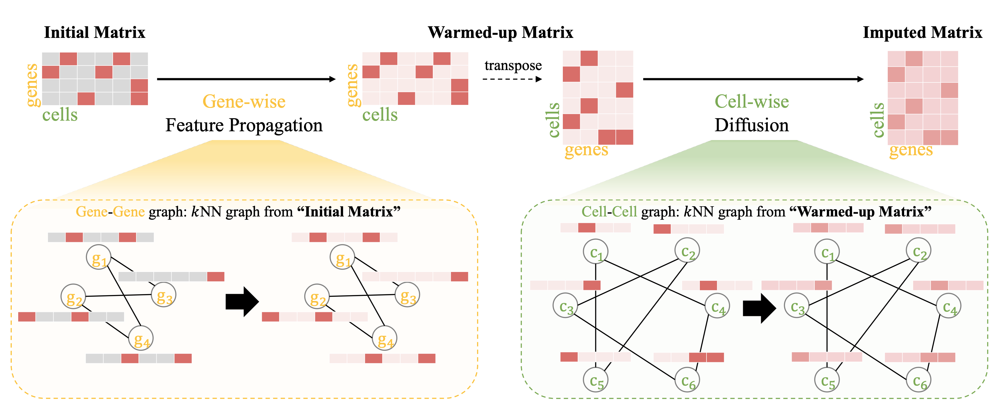

# Single-cell RNA-seq data imputation using Bi-level Feature Propagation

<p align="center">
    <a href="https://pytorch.org/" alt="PyTorch">
    </a>


The official source code for [**Single-cell RNA-seq data imputation using Bi-level Feature Propagation**](https://academic.oup.com/bib/article/25/3/bbae209/7665119), accepted at Briefings in Bioinformatics (Volume 25, May 2024).

## Overview

Single-cell RNA sequencing (scRNA-seq) enables the exploration of cellular heterogeneity by analyzing gene expression profiles in complex tissues. However, scRNA-seq data often suffer from technical noise, dropout events and sparsity, hindering downstream analyses. Although existing works attempt to mitigate these issues by utilizing graph structures for data denoising, they involve the risk of propagating noise and fall short of fully leveraging the inherent data relationships, relying mainly on one of cell–cell or gene–gene associations and graphs constructed by initial noisy data. To this end, this study presents single-cell bilevel feature propagation (scBFP), two-step graph-based feature propagation method. It initially imputes zero values using non-zero values, ensuring that the imputation process does not affect the non-zero values due to dropout. Subsequently, it denoises the entire dataset by leveraging gene–gene and cell–cell relationships in the respective steps. Extensive experimental results on scRNA-seq data demonstrate the effectiveness of scBFP in various downstream tasks, uncovering valuable biological insights.

</img>

## Requirements
- Python version : 3.9.16
- Pytorch version : 1.10.0
- scanpy : 1.9.3

## Download data

Create the directory to save dataset.
```
mkdir dataset
```

You can download preprocessed data [here](https://www.dropbox.com/sh/eaujyhthxjs0d5g/AADzvVv-h2yYWaoOfs1sybKea?dl=0)

## How to Run

You can simply reproduce the result with following codes  
```
git clone https://github.com/Junseok0207/scBFP.git
cd scBFP
sh run.sh
```

## Hyperparameters

`--name:`
Name of the dataset.  
usage example :`--dataset baron_mouse`

`--gene_k:`
Number of neighbors in gene-gene graph  
usage example :`--k 10`

`--cell_k:`
Number of neighbors in cell-cell graph  
usage example :`--k 10`

`--gene_iter:`
Number of iterations in feature propagation using gene-gene graph  
usage example :`--iter 10`

`--cell_iter:`
Number of iterations in feature propagation using cell-cell graph  
usage example :`--iter 40`

Using above hyper-parmeters, you can run our model with following codes  

```
python main.py --name baron_mouse --gene_k 10 --cell_k 10 --gene_iter 10 --cell_iter 40
```

